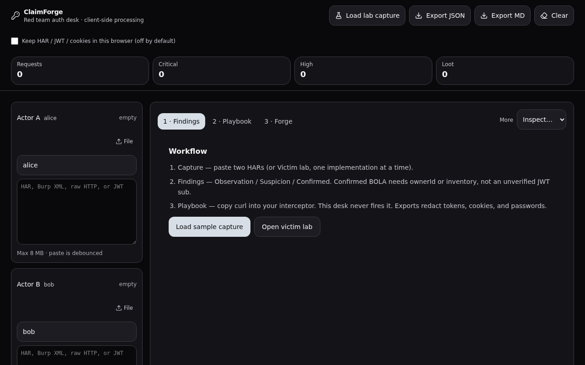
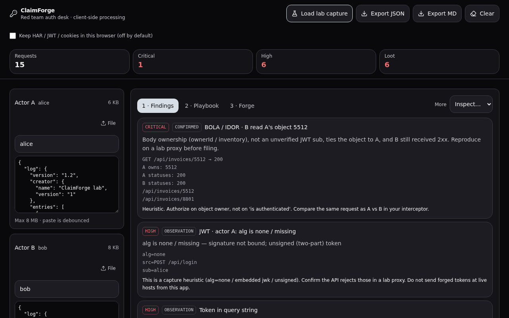
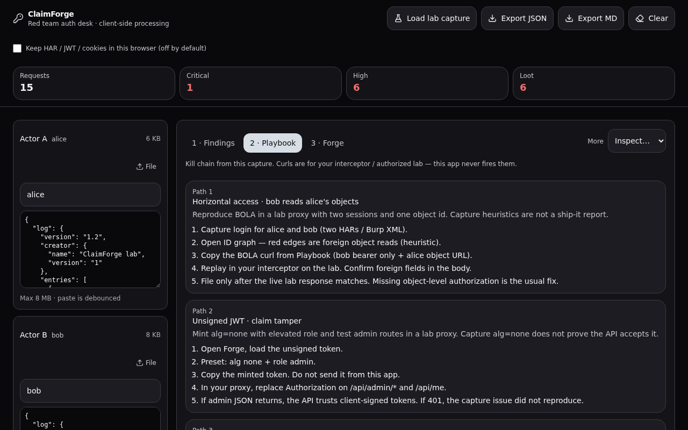
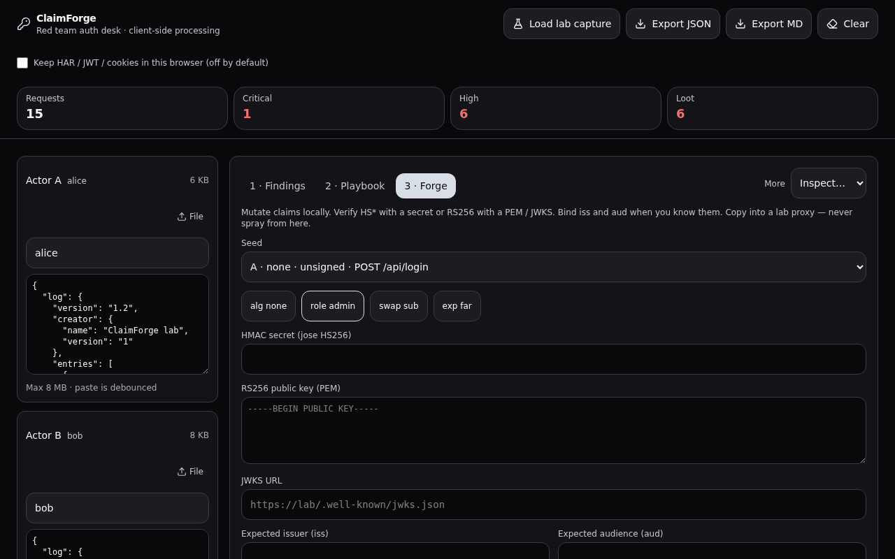
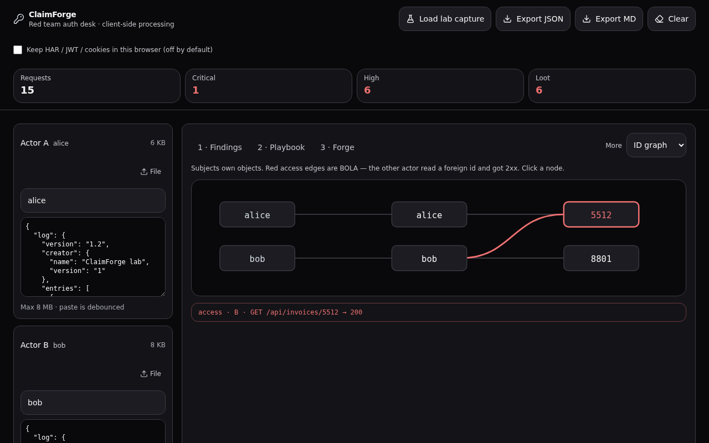
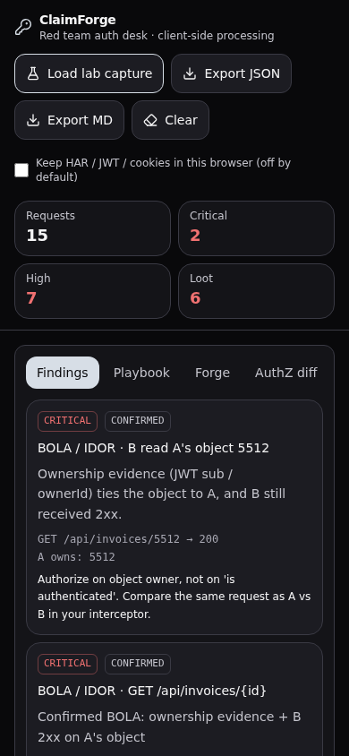

# ClaimForge

Client-side red-team auth desk. Import two captures (HAR, Burp Save-items XML, raw HTTP, or JWT). Analysis stays in the browser.

## Desk

Primary tabs (arrow keys / Home / End move between these only):

1. **Findings** — BOLA/IDOR, JWT, cookies, CORS, mass-assign. Observation / Suspicion / Confirmed. Confirmed BOLA needs trusted **response** `ownerId` / inventory plus analyst actor map — never request body/query/path or an unverified JWT `sub`.
2. **Playbook** — kill chain + curl / raw HTTP for your interceptor. This app never fires them.
3. **Forge** — alg none, role admin, swap `sub`, HS256 sign, RS256 / JWKS verify, iss/aud.

**More** is a separate inspect menu (not in the tab list): AuthZ diff, ID graph, Loot, Timeline, Traffic, Victim lab.

Captures are not stored unless you check **Keep HAR / JWT / cookies in this browser**. Exports redact tokens, cookies, and passwords.













## Run

```bash
npm ci
npm run dev
```

Gates:

```bash
npm run typecheck
npm run lint
npm run test
npm run test:e2e
npm run build
```

`npm run test` runs ClaimForge unit tests (`test:claimforge`), including desk keyboard/ARIA helpers, parser fuzz, and accuracy fixtures. GitHub Actions (`.github/workflows/ci.yml`) runs `npm ci`, typecheck, lint, and `test:claimforge`. `npm run test:e2e` expects the app already serving (same host as `npm run dev`).

Heuristics are capture-side. Replay curls are for an authorized lab proxy.

## Victim lab

Same-origin API with **Vulnerable** and **Fixed** implementations (separate capture buckets). Fixed signs HS256 with a server-only key, binds role to the account record, and revokes JWT `jti` on logout. Vulnerable still accepts alg=none and does not revoke.

## Scope

Authorized lab / engagement traffic only. ClaimForge does not send captured requests at live hosts (optional JWKS URL fetch is the only network call you can opt into).

## Threat model and limitations

See [docs/THREAT-MODEL.md](docs/THREAT-MODEL.md).
